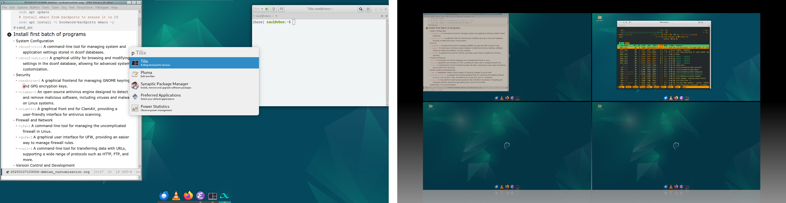

# Debian customization notes/scripts




## Description

Notes and scripts to customize a basic Debian stable (+ Mate Desktop Environment) installation. Briefly, these would expand the default repositories, install a number of programs and customize the window/desktop management. The list of programs can be divided into 3 groups with only the first one being recommended for the customization and the last 2 being entirely optional and highly subjective. Customization of the window/desktop management relies on the use of the following programs, *Compiz*, *Quicktile*, *Albert* and *Plank*, as well as, the modification of the default panels. The notes and scripts provide commands to backup the default configuration to facilitate reverting some of all of the changes.


### Notes

Note files are written in Emacs `org-roam` format (an extension of `org-mode`) with `20250107103006-debian_customization.org` being the main file. It provides descriptions and code for all the customization steps. Link to additional notes are provided for some headers. For these to work as intended it is necessary to move them to the `org-roam-directory`. Below is a sample configuration using `straight.el`

```emacs-lisp
(use-package org-roam
  :straight (org-roam :type git
                      :flavor melpa
                      :files (:defaults "extensions/*" "org-roam-pkg.el")
                      :host github
                      :repo "org-roam/org-roam")
  :custom
  (org-roam-directory ~/Documents/Org-files/Org-roam)
  )
```


### Scripts

A number of scripts to automate the customization are provided. It is recommended to carefully read all of them (or the `20250107103006-debian_customization.org` file, mentioned above) to see which software is going to be installed before their execution.

To execute them download the whole repository into the home directory and execute the scripts from its folder (`$HOME/Debian_customization/Scripts`). Below is a sample code of how to run all of them.

```bash
sudo ./Debian_customization_1.sh && ./Debian_customization_1_aux.sh &&\
      sudo ./Debian_customization_2.sh && ./Debian_customization_2_aux.sh &&\
      sudo ./Debian_customization_3.sh && ./Debian_customization_3_aux.sh
```

Note that some of the scripts need to be run as super user while others should be run as a regular user. The former would reduce the number of times it is required to type the superuser password while the latter would configure some program options that need to be run as a regular user. Depending on the computer resources or internet connection the execution may require to type the superuser password more than once, especially when starting a new script.


## Configuration files

Both, the main org-file and the scripts, make use of a number of configuration file for the customization. These are organized into program/categories folders (*e.g.* bash, system) and it is in these folders where the backups would be stored.


## Download folder

The script will create a directory to store all the installation files in the home directory `$HOME/Download_installation` while the org-file provides a function to get the default download directory (which may be different depending on the localization of the system). The latter requires to import a file with custom functions.
